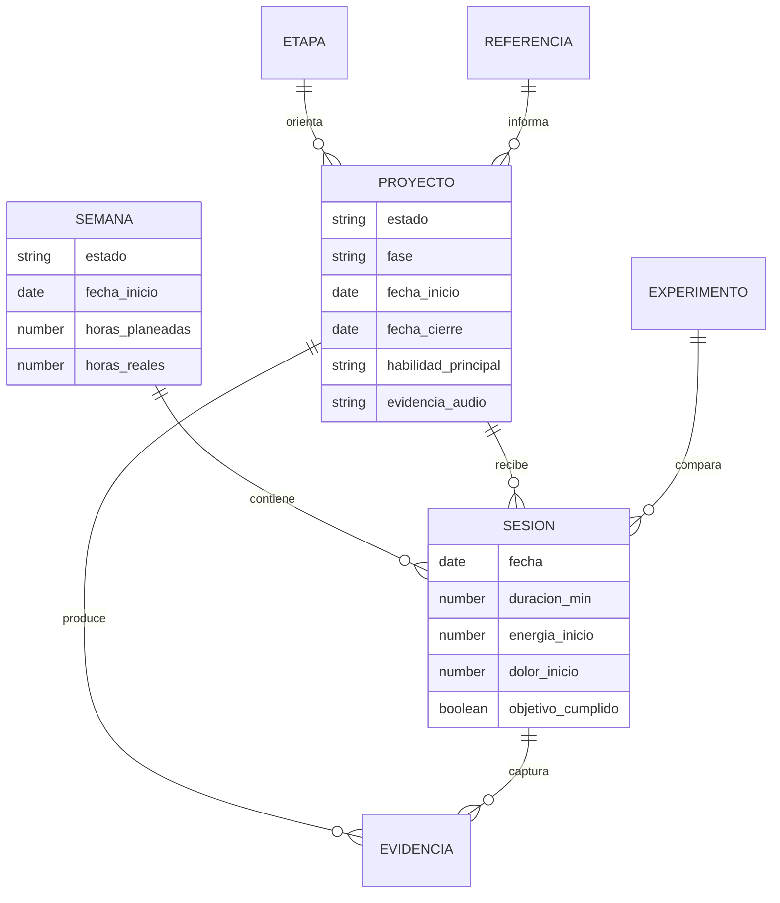
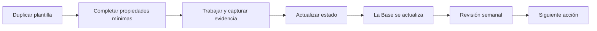
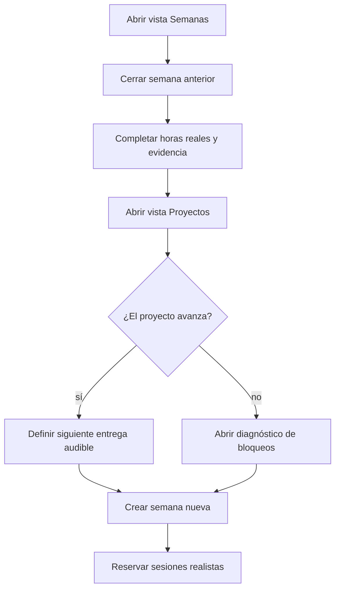
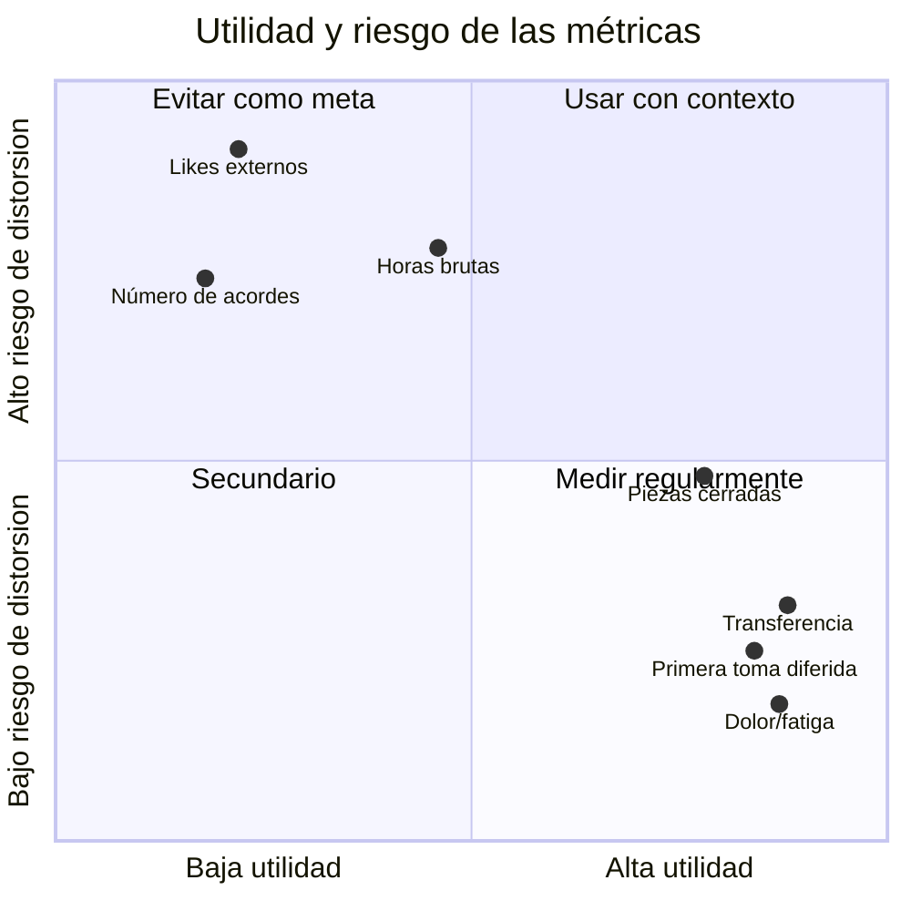

# Panel dinámico, propiedades y consultas

> [!abstract] Resultado
> Esta nota reúne proyectos, semanas, sesiones, experimentos y análisis sin depender de Dataview. Usa **Bases**, **Properties**, búsquedas incrustadas y etiquetas nativas de Obsidian.

## Panel principal

![[_legacy/Curso creciente 2026-08/6. Atlas visual y laboratorios/Panel de aprendizaje musical.base]]

> [!tip] Cómo usar la base
> Cambia de vista en la parte superior entre `Proyectos`, `Semanas`, `Sesiones`, `Experimentos`, `Laboratorios` y `Referencias`. Las celdas de propiedades se pueden editar desde la tabla. La base está limitada a `Teoría musical/1. Curso cresciente` y excluye la carpeta de plantillas para no contarlas como trabajo real.

La sintaxis está documentada en la [ayuda oficial de Obsidian Bases](https://obsidian.md/help/bases/syntax). Bases usa archivos YAML `.base`, filtros, propiedades y vistas; el plugin central ya está habilitado en esta bóveda.

## Modelo de información



## Estados canónicos

Usa pocos valores estables; las variantes ortográficas destruyen filtros.

| Tipo | Estados permitidos |
|---|---|
| Proyecto | `cola`, `activo`, `en-revision`, `cerrado`, `archivado` |
| Semana | `planeada`, `activa`, `cerrada` |
| Sesión | `planeada`, `hecha`, `cancelada` |
| Experimento | `planeado`, `activo`, `analizando`, `cerrado` |
| Referencia | `planeado`, `en-analisis`, `aplicado` |

No uses “terminado” y “final” como sinónimos de `cerrado`; elige un vocabulario y consérvalo.

## Fases canónicas

- `ritmo`
- `oido`
- `melodia`
- `armonia`
- `forma`
- `arreglo`
- `produccion`
- `lenguaje`
- `portafolio`
- `metapractica`

Las propiedades son categorías de seguimiento; no pretenden reducir una obra a una sola habilidad. Registra la habilidad **principal** y menciona las secundarias en el cuerpo de la nota.

## Flujo de propiedades



### Propiedades mínimas por tipo

#### Proyecto

```yaml
tipo: proyecto
estado: activo
fase: ritmo
fecha_inicio: 2026-08-11
fecha_cierre:
habilidad_principal: variación rítmica
evidencia_audio:
puntuacion:
tags:
  - curso-musica/proyecto
```

#### Semana

```yaml
tipo: semana
estado: activa
fase: ritmo
fecha_inicio: 2026-08-11
fecha_cierre: 2026-08-17
horas_planeadas: 4
horas_reales:
proyecto: "[[Proyecto 01 - Microcomposición rítmica]]"
habilidad_principal: pulso y variación
tags:
  - curso-musica/semana
```

#### Sesión

```yaml
tipo: sesion
estado: hecha
fecha: 2026-08-11
proyecto: "[[Proyecto 01 - Microcomposición rítmica]]"
habilidad_principal: síncopa
duracion_min: 42
energia_inicio: 3
dolor_inicio: 0
objetivo_cumplido: true
evidencia_audio: "ruta/al/audio-2026-08-11.wav"
tags:
  - curso-musica/sesion
```

#### Experimento

```yaml
tipo: experimento
estado: activo
fecha_inicio: 2026-08-11
fecha_cierre:
habilidad_principal: retención rítmica
condicion_a: práctica en bloque
condicion_b: práctica intercalada
resultado:
tags:
  - curso-musica/experimento
```

## Consultas nativas incrustadas

Obsidian permite incrustar resultados con bloques `query`; la sintaxis y operadores están descritos en la [ayuda oficial de Search](https://obsidian.md/help/plugins/search). Estas consultas se actualizan al modificar archivos.

### Proyectos activos

```query
path:"Teoría musical/1. Curso cresciente" [tipo:proyecto] [estado:activo]
```

### Todo proyecto no cerrado

```query
path:"Teoría musical/1. Curso cresciente" [tipo:proyecto] -[estado:cerrado] -[estado:archivado]
```

### Semanas activas

```query
path:"_legacy/Curso creciente 2026-08/4. Bitácora" [tipo:semana] [estado:activa]
```

### Experimentos en curso

```query
path:"Teoría musical/1. Curso cresciente" [tipo:experimento] ([estado:activo] OR [estado:analizando])
```

### Análisis todavía no aplicados

```query
path:"Teoría musical/1. Curso cresciente" [tipo:analisis-referencia] [aplicado:false]
```

### Tareas abiertas del curso

```query
path:"Teoría musical/1. Curso cresciente" task-todo:""
```

### Notas con evidencia todavía vacía

```query
path:"Teoría musical/1. Curso cresciente" ([tipo:proyecto] OR [tipo:sesion]) [evidencia_audio:null]
```

### Notas que mencionan dolor o fatiga

```query
path:"Teoría musical/1. Curso cresciente" (content:dolor OR content:fatiga OR content:tensión)
```

## Plantillas ya preparadas

Las siguientes plantillas ya incluyen frontmatter compatible:

- [[_legacy/Curso creciente 2026-08/1. Sistema y plantillas/Plantilla - Proyecto de composición]]
- [[_legacy/Curso creciente 2026-08/1. Sistema y plantillas/Plantilla - Semana de estudio]]
- [[6. Práctica/2. Plantillas/Sesión deliberada]]
- [[_legacy/Curso creciente 2026-08/1. Sistema y plantillas/Plantilla - Análisis de referencia]]
- [[6. Práctica/2. Plantillas/Rúbrica - Composición]]

También se añadieron propiedades a los seis proyectos y a la primera semana existentes.

## Tablero mínimo de revisión semanal



Preguntas de revisión:

- ¿qué evidencia demuestra aprendizaje y no solo actividad?;
- ¿qué puede recuperarse después de 48 horas?;
- ¿qué proyecto merece cierre antes de abrir otro?;
- ¿qué estrategia se repitió sin mejorar el resultado?;
- ¿hay carga, dolor o fatiga que exija ajuste?;
- ¿cuál es la siguiente acción observable de menos de veinte minutos?

## Convenciones para archivos de evidencia

Una convención simple evita pérdidas:

```text
AAAA-MM-DD_proyecto_tipo_vNN.ext
2026-08-11_p01_ritmo_v01.wav
2026-08-11_p01_partitura_v01.pdf
2026-08-12_p01_revision_v02.wav
```

En la nota del proyecto enlaza la versión más reciente, pero conserva el historial en la tabla de versiones. No reemplaces una exportación sin fecha si sirve como evidencia de cambio.

## Qué medir y qué no convertir en puntuación



Las horas son contexto de carga, no prueba de dominio. Una puntuación de rúbrica es una conversación estructurada con evidencia audible, no una medida psicométrica validada ni un valor artístico absoluto.

## Mantenimiento mensual de diez minutos

- [ ] Corregir estados escritos de forma inconsistente.
- [ ] Completar fechas de proyectos cerrados.
- [ ] Enlazar audios que siguen fuera de la bóveda.
- [ ] Archivar notas de prueba que ya cumplieron su función.
- [ ] Verificar que haya una sola semana activa.
- [ ] Revisar proyectos en `cola` y eliminar compromisos ficticios.
- [ ] Exportar o respaldar las obras terminadas.

## Solución de problemas

### La Base aparece vacía

1. Comprueba que el archivo esté bajo `Teoría musical/1. Curso cresciente`.
2. Confirma que tenga `tipo:` en el frontmatter.
3. Revisa que el valor coincida exactamente con la vista: `proyecto`, `semana`, `sesion`, `experimento`, `laboratorio` o `analisis-referencia`.
4. Abre el archivo `.base` directamente para revisar filtros.

### La búsqueda no encuentra una propiedad

- usa `[propiedad:valor]`;
- evita espacios y acentos en el nombre de la propiedad;
- los valores con espacios pueden necesitar comillas;
- para propiedades vacías usa `[propiedad:null]`;
- consulta el comando **Explain search term** en Search.

### No ves el editor gráfico de propiedades

Aunque el panel gráfico `Properties view` está deshabilitado, el frontmatter sigue siendo válido y Bases puede usarlo. Puedes habilitar el plugin central Properties si quieres una interfaz adicional; no es requisito para este sistema.

## Puerta de salida

- [ ] La vista Proyectos muestra los seis proyectos.
- [ ] La vista Semanas muestra la semana de calibración.
- [ ] Al duplicar una plantilla, la nota aparece en la vista correspondiente.
- [ ] Un proyecto activo enlaza al menos una evidencia audible al cerrarse.
- [ ] La revisión semanal actualiza estado, siguiente acción y carga.

Siguiente: [[_legacy/Curso creciente 2026-08/6. Atlas visual y laboratorios/10. Glosario visual y conexiones]].
