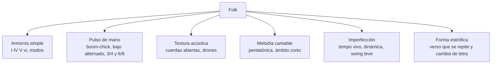

# Folk en Strudel: explorar, improvisar, entender

> [!warning] Archivado el 2026-10-02
> Primer borrador de la guía, sustituido el mismo día por [[4. Folk desde cero]],
> que es la versión que pediste: especializada en Strudel, con `music-abc` y
> Mermaid, y con retos en vez de patrones resueltos. Se guarda porque nada se
> borra. **No lo uses como referencia**: tiene errores, comprobados al verificar
> la versión nueva.
>
> - La plantilla de banda (§5.2) **no arranca**: en `esc + ":pentatonic"`, las
>   comillas dobles convierten `":pentatonic"` en mini-notación, y no es válida.
> - El bajo alternado (§3.2) y el `piso` de la plantilla (§5.2) suenan **una sola
>   nota por compás**: el ritmo sale de `rootNotes`, que está a la izquierda del `.add`.
> - La `voz` de la plantilla (§5.2) hace `.add(n(7))` después de `.scale()`, y ahí
>   ya no cambia la altura.
> - `.nudge()` (§3.5 y chuleta) solo actúa sobre samples: con los instrumentos
>   `gm_*` no hace nada.

> [!abstract] Qué es esta guía
> [[3. Folk]] construye **una canción** (picking real, Sonar, toma humana).
> Esta guía sirve para otra cosa: **entender el folk tocándolo**. Cada sección
> aísla un ingrediente del género, te da un patrón que suena *ya* (sonidos
> internos de Strudel, sin MIDI) y una lista de **palancas**: cosas que puedes
> cambiar en vivo para oír qué hace cada una.
>
> Los patrones son **andamios genéricos**, no obras. Las decisiones (tonalidad,
> progresión, motivo) son tuyas: cámbialas antes de usarlas en nada propio.

> [!tip] Cómo leerla
> 1. Dale play al bloque.
> 2. Toca **una sola palanca** a la vez, con el patrón sonando.
> 3. Escribe en la bitácora qué cambió en lo que *sientes*, no en el código.
>
> Regla 6 de [[Inicio]]: si no termina en una decisión musical, no se aprendió.
> Cada sección cierra con una.

---

## 0. Qué hace que algo suene "folk"

El folk es menos un sonido que **una actitud ante la complejidad**: poca armonía,
mucha repetición, y toda la atención puesta en la historia (la voz) y en el
pulso humano.



| Ingrediente | Lo que NO es | Dónde lo oyes |
|---|---|---|
| Armonía simple | jazz, dominantes secundarios cada compás | Dylan, Lumineers |
| Drone / cuerda abierta | pad sintético perfecto | Bon Iver (*For Emma*), Andrew Bird |
| Pulso de mano | cuantización a rejilla | todos |
| Ámbito melódico corto | melismas de 2 octavas | Dylan: la letra manda |
| Forma estrófica | estructura pop con drop | baladas tradicionales |

**La trampa de Strudel:** es una máquina de rejilla perfecta. El folk vive
fuera de la rejilla. La mitad de esta guía es aprender a *ensuciar* el patrón.

---

## 1. La paleta de sonidos

Strudel trae instrumentos General MIDI (`gm_*`). Estos son los folk:

```strudel
setcpm(80/4)
note("<c3 g3 c4 e4>*4")
  .s("<gm_acoustic_guitar_nylon gm_acoustic_guitar_steel gm_banjo gm_fiddle gm_harmonica gm_accordion gm_cello gm_piano>")
  .slow(2)
```

| Sonido | Papel típico |
|---|---|
| `gm_acoustic_guitar_steel` | el motor: picking y rasgueo |
| `gm_acoustic_guitar_nylon` | íntimo, más triste |
| `gm_acoustic_bass` / `gm_contrabass` | bajo de banda (Lumineers) |
| `gm_banjo` | roll rápido, americana |
| `gm_fiddle` / `gm_violin` | melodía sostenida, drones dobles |
| `gm_cello` | drone grave, tristeza |
| `gm_harmonica` | respuesta entre frases (Dylan) |
| `gm_accordion` | acorde-colchón con aire |
| `piano` | balada folk al piano |

Percusión folk (no batería de rock): bombo con pie, palmas, pandereta.

```strudel
setcpm(90/4)
s("bd ~ bd ~, ~ cp ~ cp, [~ hh]*4")
  .bank("RolandTR808").gain(.6)
```

> [!note] Palanca
> Cambia `cp` por `rim` o quita el `hh`. El folk tolera *muy poca* percusión;
> nota cuánta puedes quitar antes de que se caiga el pulso.

---

## 2. Armonía: el diccionario mínimo

Conecta con [[6. Crear progresiones tonales]], [[0. Modos]] y
[[3. Intercambios modales]].

### 2.1 Las cuatro familias de progresión folk

| Familia | Grados | Sensación |
|---|---|---|
| **Tres acordes** | I · IV · V | himno, plaza, Dylan temprano |
| **La de los cuatro** | I · V · vi · IV | Lumineers, pop-folk |
| **Menor modal** | i · VII · VI · VII (eólico) | balada, triste, *murder ballad* |
| **Mixolidio** | I · bVII · IV · I | celta, abierto, "sol de tarde" |
| **Dórico** | i · IV (mayor) | antiguo y luminoso a la vez |

Strudel puede tocarlas por **grados**, así cambias la tonalidad sin reescribir:

```strudel
setcpm(76/4)
// cambia "C:major" y los grados para explorar
n("<[0,2,4] [3,5,7] [4,6,8] [0,2,4]>")
  .scale("C:major")
  .s("gm_acoustic_guitar_steel")
  .room(.3)
```

O con nombres de acorde y voicing automático:

```strudel
setcpm(76/4)
chord("<C G Am F>")
  .voicing()
  .s("gm_acoustic_guitar_steel")
  .room(.3)
```

> [!note] Palancas
> - Cambia `"C:major"` por `"A:minor"`, `"D:dorian"`, `"G:mixolydian"`. Mismos
>   grados, otro mundo. **¿Cuál suena a "folk viejo"?**
> - Cambia un acorde por su **sus2/sus4** (`Csus2`, `Gsus4`). El folk usa los sus
>   porque son cuerdas abiertas en guitarra.
> - Cambia el ritmo armónico: `<C C G Am>` vs `<C G Am F>`. El folk suele
>   **quedarse** en un acorde más de lo que crees.

### 2.2 El drone: el secreto del sonido abierto

En guitarra folk una cuerda al aire suena **sobre todos los acordes**. Ese pedal
crea las disonancias suaves que hacen que suene "a madera".

```strudel
setcpm(70/4)
stack(
  chord("<C Am F G>").voicing().s("gm_acoustic_guitar_steel").gain(.7),
  note("g4 ~ g4 ~").s("gm_acoustic_guitar_steel").gain(.4),  // cuerda abierta
  note("c2").s("gm_cello").gain(.5).slow(4)                   // drone grave
).room(.4)
```

> [!note] Palanca
> Cambia la nota del drone (`g4` → `e4`, `d4`). Oye contra qué acorde roza.
> Ese roce es la "tristeza" de Bon Iver o Avi Buffalo.

**Decisión musical:** elige qué nota será la cuerda al aire de tu próxima
pieza y en qué acorde va a rozar a propósito.

---

## 3. Ritmo: el pulso de mano

Conecta con [[1. Motivos rítmicos]]. Aquí está lo que de verdad define el género.

### 3.1 Boom-chick (bajo + acorde)

El patrón más antiguo: bajo en 1 y 3, acorde en 2 y 4.

```strudel
setcpm(96/4)
let prog = "<C F G C>"
stack(
  chord(prog).rootNotes(2).struct("x ~ x ~").s("gm_acoustic_bass"),
  chord(prog).voicing().struct("~ x ~ x").s("gm_acoustic_guitar_steel").gain(.6)
)
```

### 3.2 Bajo alternado (raíz – quinta)

Lo mismo que el pulgar del Travis picking de [[3. Folk]], pero en código.
`rootNotes` da la raíz; sumamos 7 semitonos para la quinta.

```strudel
setcpm(88/4)
let prog = "<C Am F G>"
stack(
  chord(prog).rootNotes(2)
    .add(note("<0 7 0 7>*4".fast(1)))   // raíz quinta raíz quinta
    .s("gm_acoustic_guitar_steel"),
  chord(prog).voicing().struct("[~ x]*4").s("gm_acoustic_guitar_steel").gain(.45)
).room(.25)
```

### 3.3 Travis / arpegio con `arp`

```strudel
setcpm(84/4)
n("<[0,2,4,7] [5,7,9,12] [3,5,7,10] [4,6,8,11]>")
  .scale("C:major")
  .arp("0 2 1 3 0 2 1 3")
  .s("gm_acoustic_guitar_nylon")
  .room(.3)
```

> [!note] Palancas
> - `arp("0 2 1 3 ...")` → `arp("0 1 2 3")` (subida plana) o `arp("0 3 1 2")`.
>   Cada patrón es una "mano derecha" distinta.
> - Cambia a `arp("<0 2 1 3>*8")` y luego `"*6"`. El `*6` sobre 4/4 da un
>   tresillo que suena a balada vieja.

### 3.4 Compases ternarios: 3/4 y 6/8

Media tradición folk es vals o *jig*. En Strudel, un ciclo = un compás: divide
en 3 o en 6.

```strudel
setcpm(60/3)   // vals: ~60 compases por minuto... ajusta a oído
stack(
  chord("<G C D G>").rootNotes(2).struct("x ~ ~").s("gm_acoustic_bass"),
  chord("<G C D G>").voicing().struct("~ x x").s("gm_acoustic_guitar_steel").gain(.55)
)
```

```strudel
setcpm(40/1)
// 6/8: dos pulsos de tres corcheas
n("<[0,2,4]>").scale("D:mixolydian")
  .arp("0 1 2 1 2 1")
  .s("gm_acoustic_guitar_steel")
```

> [!note] Palanca
> Toma la progresión de 3.1 y pásala a `struct("x ~ ~")` / `"~ x x"`. La misma
> armonía en 3/4 cambia de "himno" a "nana". **Esa es la decisión.**

### 3.5 Ensuciar la rejilla (lo más importante de la guía)

Un patrón cuantizado suena a máquina. Estas herramientas lo humanizan:

| Herramienta | Qué imita |
|---|---|
| `.swingBy(1/12, 4)` | el "galope" leve de la mano derecha |
| `.gain("<.8 .6 .7 .55>*8")` o `.gain(perlin.range(.5,.9))` | dinámica desigual entre golpes |
| `.nudge(rand.range(0,.015))` | golpes un pelo tarde, al azar |
| `.degradeBy(.1)` | notas que la mano "se come" |
| `.sometimesBy(.2, x => x.ply(2))` | un adorno ocasional |

```strudel
setcpm(84/4)
n("<[0,2,4,7] [5,7,9,12] [3,5,7,10] [4,6,8,11]>")
  .scale("C:major")
  .arp("0 2 1 3 0 2 1 3")
  .s("gm_acoustic_guitar_steel")
  .swingBy(1/12, 4)
  .gain(perlin.range(.45, .85))
  .nudge(rand.range(0, .012))
  .degradeBy(.06)
  .room(.3)
```

> [!warning] Experimento clave
> Activa y desactiva **una** línea de humanización a la vez. Comenta cada línea
> con `//`. Descubre cuál te importa más: casi siempre es la **dinámica**
> (`gain`), no el timing.

**Decisión musical:** elige el compás (4/4, 3/4 o 6/8) y el patrón de mano
derecha de tu próxima idea, y anota qué humanización lo hace sonar "tuyo".

---

## 4. Melodía: cantable antes que bonita

Conecta con [[1. Composición melódica]] y [[0. Enlaces 2.0 y motivos]].

### 4.1 La pentatónica es el folk

La mayoría de melodías tradicionales caben en cinco notas. Explora con escala
pentatónica: es casi imposible sonar "mal".

```strudel
setcpm(80/4)
stack(
  chord("<C Am F G>").voicing().s("gm_acoustic_guitar_steel").gain(.5),
  n("<0 2 [4 3] 2>*2".add("<0 1 2 0>"))
    .scale("C4:major:pentatonic")
    .s("gm_fiddle").gain(.6)
).room(.35)
```

### 4.2 Improvisar con azar controlado

Strudel puede *proponer* melodías dentro de la escala. Úsalo como compañero de
improvisación: él tira frases, tú escuchas, y te quedas con la que te diga algo.

```strudel
setcpm(80/4)
stack(
  chord("<C Am F G>").voicing().s("gm_acoustic_guitar_steel").gain(.45),
  n(irand(6).segment(4))           // 4 notas al azar por compás
    .scale("C4:major:pentatonic")
    .degradeBy(.3)                 // silencios: la voz respira
    .s("gm_harmonica").gain(.55)
    .ribbon(0, 2)                  // repite 2 compases: un "motivo"
).room(.35)
```

> [!tip] Cómo improvisar con esto
> - `.ribbon(0, 2)` congela un fragmento del azar. Cambia el `0` (`3`, `17`,
>   `42`…) para "sacar otra frase del sombrero". Cuando una te guste, **cópiala a
>   notas fijas** y ya es tuya.
> - Quita `.ribbon` para un flujo infinito, y toca encima en guitarra o
>   KeyStep. Strudel hace de banda; tú haces la voz.
> - `irand(6)` → `irand(4)`: ámbito más corto, más "Dylan hablando".

### 4.3 Call and response (pregunta y respuesta)

El gesto de la armónica de Dylan: la voz dice algo, el instrumento contesta en
el hueco.

```strudel
setcpm(80/4)
let escala = "G3:major:pentatonic"
stack(
  chord("<G C G D>").voicing().s("gm_acoustic_guitar_steel").gain(.45),
  n("<[0 2 4 2] ~>").scale(escala).s("gm_voice_oohs").gain(.6),   // "voz"
  n("<~ [7 6 4 ~]>").scale(escala).s("gm_harmonica").gain(.5)      // respuesta
)
```

> [!note] Palanca
> La respuesta usa notas **más altas** que la pregunta. Inviértelo y oye cómo
> cambia de "contestar" a "lamentarse".

**Decisión musical:** extrae con `ribbon` un motivo de 2 compases que te guste,
fíjalo como notas y decide si es pregunta o respuesta.

---

## 5. Textura: arreglar como banda folk

Conecta con `1. Teoría/8. Textura y arreglo/`.

### 5.1 La regla de las capas

Una banda folk casi nunca tiene más de **tres capas activas** a la vez:

| Capa | Rango | Instrumento |
|---|---|---|
| Piso | grave | bajo / pulgar / cello |
| Motor | medio | guitarra picking o rasgueo |
| Voz | agudo | melodía, fiddle, armónica |

### 5.2 Plantilla de banda con mute por capa

Usa esto como mesa de mezcla: comenta/descomenta capas en vivo.

```strudel
setcpm(88/4)
let prog = "<C Am F G>"
let esc  = "C:major"

let piso  = chord(prog).rootNotes(2).add(note("0 7")).s("gm_acoustic_bass").gain(.7)
let motor = n("<[0,2,4,7] [5,7,9,12] [3,5,7,10] [4,6,8,11]>").scale(esc)
              .arp("0 2 1 3 0 2 1 3").s("gm_acoustic_guitar_steel")
              .gain(perlin.range(.4,.75)).swingBy(1/12,4)
let voz   = n(irand(5).segment(4)).scale(esc + ":pentatonic").add(n(7))
              .degradeBy(.35).ribbon(5, 2).s("gm_fiddle").gain(.5)
let pulso = s("bd ~ ~ ~, ~ ~ cp ~").bank("RolandTR808").gain(.35)

stack(
  piso,
  motor,
  voz,
  // pulso,
).room(.35)
```

> [!note] Palancas de arreglo
> - Empieza solo con `motor`. Añade una capa cada 4 compases. Así se construye
>   una canción folk: **por acumulación**, no por cambio.
> - Quita el `piso` en el "verso 2" y vuelve a ponerlo: la entrada del bajo es el
>   clímax más barato y efectivo del género (Lumineers lo hace siempre).

### 5.3 El puente dream-folk

Tu terreno (Beach House × Bon Iver): folk con reverb larga y bordes suaves.

```strudel
setcpm(66/4)
n("<[0,2,4,6] [5,7,9,11] [3,5,7,9] [4,6,8,10]>")
  .scale("A:minor")
  .arp("0 1 2 3 2 1")
  .s("gm_acoustic_guitar_nylon")
  .lpf(perlin.range(900, 2500).slow(8))
  .room(.9).size(.9)
  .delay(.3).delaytime(3/8).delayfeedback(.4)
  .gain(perlin.range(.35,.65))
```

> [!note] Palanca
> Sube `room` de `.2` a `.9`. ¿En qué punto deja de ser folk y pasa a ser dream
> pop? **Ese punto es tu sonido.** Anótalo.

---

## 6. Forma: estrófica y con arco

El folk tradicional repite la **misma música** con letra nueva. El arco no viene
de cambiar acordes: viene de **densidad**.


Strudel puede programar el arco con `arrange`:

```strudel
setcpm(88/4)
let prog  = "<C Am F G>"
let motor = chord(prog).voicing().arp("0 2 1 2").fast(2).s("gm_acoustic_guitar_steel").gain(.6)
let piso  = chord(prog).rootNotes(2).s("gm_acoustic_bass").gain(.7)
let voz   = n("0 2 4 2").scale("C4:major:pentatonic").s("gm_fiddle").gain(.5)

arrange(
  [4, motor],
  [4, stack(motor, voz)],
  [4, stack(motor, voz, piso)],
  [4, motor.degradeBy(.4)],
).room(.35)
```

**Decisión musical:** dibuja el arco de densidad de tu próxima pieza antes de
escribir una sola nota.

---

## 7. Mapa por influencia

No para copiar: para saber **qué palanca** mover cuando quieras ir hacia allá.

| Influencia | Palanca principal en esta guía |
|---|---|
| **Bob Dylan** | §2.1 tres acordes · §4.2 `irand(4)` · §4.3 armónica |
| **Lumineers** | §3.1 boom-chick · §5.2 entrada del piso · palmas en §1 |
| **Bon Iver** | §2.2 drone · §5.3 reverb · falsete = melodía en octava alta |
| **Andrew Bird** | §4.3 call and response · fiddle · loops (`ribbon`) |
| **Avi Buffalo** | §2.2 roces · §3.5 humanización fuerte |
| **Harmless / Twin Cabins** | §5.3 dream-folk · tempo bajo · nylon |

---

## 8. Rutina de exploración (20 minutos)

| Min | Qué | Sección |
|---|---|---|
| 0–3 | Elegir un modo y una progresión de una familia | §2.1 |
| 3–8 | Elegir mano derecha y compás | §3 |
| 8–12 | Humanizar hasta que no suene a máquina | §3.5 |
| 12–17 | Improvisar melodía con `ribbon`; fijar un motivo | §4.2 |
| 17–20 | **Grabar** 30–60 s (exportar desde strudel.cc o tocar encima) | — |

> [!danger] Regla 2 de [[Inicio]]
> Semana sin audio es semana en blanco. La exploración cuenta solo si termina
> en un archivo de audio, aunque sea de 30 segundos.

---

## 9. Chuleta

```text
setcpm(BPM/4)                     tempo (4/4). Para 3/4: setcpm(BPM/3)
n("0 2 4").scale("C:major")       melodía por grados
chord("<C G Am F>").voicing()     acordes con voicing automático
.rootNotes(2)                     raíz del acorde en octava 2
.arp("0 2 1 3")                   mano derecha (orden de notas)
.struct("x ~ x ~")                ritmo de ataques
.swingBy(1/12, 4)                 galope leve
.gain(perlin.range(.4,.8))        dinámica viva
.nudge(rand.range(0,.012))        timing humano
.degradeBy(.1)                    notas que se caen
irand(6).segment(4)               melodía aleatoria
.ribbon(semilla, compases)        congelar un fragmento del azar
arrange([4, a], [4, b])           forma por secciones
.room(.3) .delay(.3) .lpf(2000)   espacio
```

---

## Relacionado

- [[3. Folk]] — construir una canción folk real (picking, Sonar, toma)
- [[0. Qué es y cómo se usa]] — sintaxis base de Strudel en la bóveda
- [[6. Crear progresiones tonales]] · [[0. Modos]] · [[3. Intercambios modales]]
- [[1. Motivos rítmicos]] · [[1. Composición melódica]]
